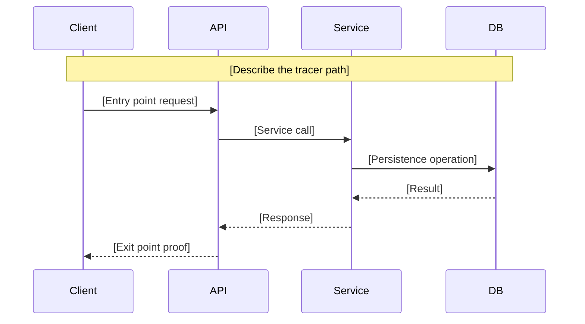

# Tracer Bullet Report: [Feature Name]

> Generated by `/speckit.tracer` on [DATE]
> Feature branch: [BRANCH]
> Status: [PASS / FAIL / PARTIAL]

## Slice Diagram

## Layer Map

| # | Layer | Component | Full Implementation | Tracer Implementation | Status |
|---|-------|-----------|--------------------|-----------------------|--------|
| 1 | Entry | | | | |
| 2 | Validation | | | | |
| 3 | Service | | | | |
| 4 | Async | | | | |
| 5 | Persistence | | | | |
| 6 | Exit | | | | |

## Scope Fence (What Was Deferred)

| Deferred Item | Layer(s) | Rationale |
|--------------|----------|-----------|
| | | |

## Verification Results

### Smoke Test

- **Test command**: `[command to run]`
- **Result**: PASS / FAIL
- **Evidence**: [describe what was observed]

### Checklist

- [ ] Entry point receives request without crashing
- [ ] Every layer touched — no skipped layers
- [ ] Real data in persistence layer
- [ ] Exit point produces observable proof
- [ ] Smoke test passes against real infrastructure
- [ ] No mocks in integration path
- [ ] New infrastructure documented

## Expansion Map

### Track A — Backend
| Work Item | Layer(s) | Depends On | Parallel? |
|-----------|----------|------------|-----------|
| | | | |

### Track B — Frontend
| Work Item | Layer(s) | Depends On | Parallel? |
|-----------|----------|------------|-----------|
| | | | |

### Track C — Tests
| Work Item | Layer(s) | Depends On | Parallel? |
|-----------|----------|------------|-----------|
| | | | |

### Track D — Infrastructure
| Work Item | Layer(s) | Depends On | Parallel? |
|-----------|----------|------------|-----------|
| | | | |

## Risk Register

| Risk | Discovered During | Impact | Mitigation |
|------|------------------|--------|------------|
| | | | |

## Tasks Completed by Tracer

The following tasks in `tasks.md` were completed during the tracer bullet phase:

- [X] Task N: [description]
- [X] Task M: [description]
